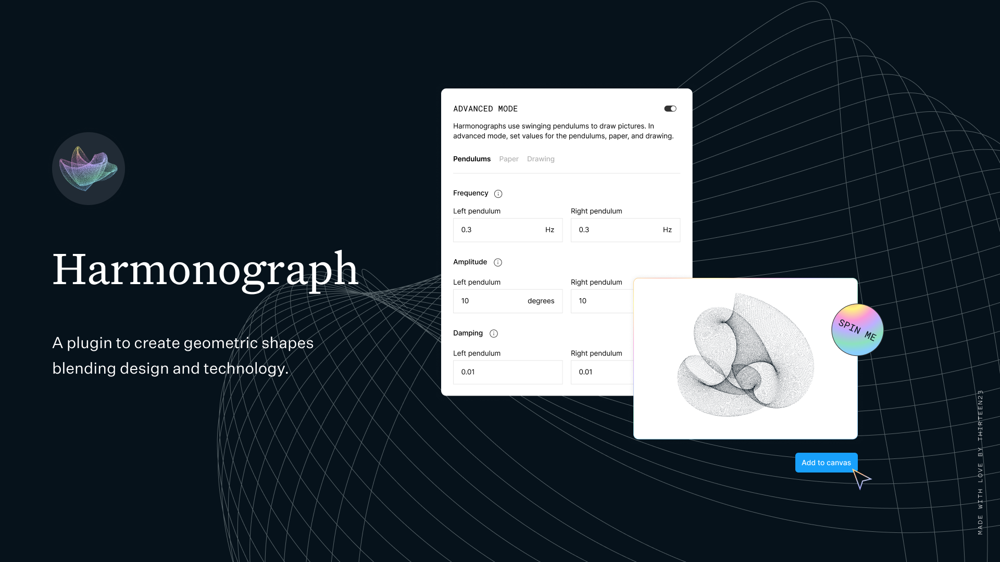

<a href="https://thirteen23.com">
    <picture>
    	<source media="(prefers-color-scheme: dark)" srcset="./documentation/thirteen23_logo_light.svg"> 
    
        </picture>
</a>

# thirteen23 harmonograph



[thirteen23 harmonograph](https://github.com/thirteen23/figma-harmonograph) is a Figma plugin that allows you to create beautiful mathematical art! This powerful tool allows you to generate intricate and beautiful harmonographs. Customize your harmonograph the frequency, amplitude, and steps in simple mode, or jump into advanced mode to take full control! If you need some inspiration, click the 'Spin Me' button for a randomized harmonograph.

<picture>
	<source media="(prefers-color-scheme: dark)" srcset="./documentation/divider-dark.png"> 
    	
</picture>

## Preview

// Perhaps we place some gif here

<picture>
	<source media="(prefers-color-scheme: dark)" srcset="./documentation/divider-dark.png"> 
    	
</picture>

## Usage

- Navigate to the [thirteen23 harmonograph](https://github.com/thirteen23/figma-harmonograph) plugin page, select Open in… and select your desired Figma file.
- Save or Like it to use it later in Figma. Go to **Plugins / Saved / thirteen23 harmonograph**

<picture>
	<source media="(prefers-color-scheme: dark)" srcset="./documentation/divider-dark.png"> 
    	
</picture>

## Development

To get started, install the dependencies and build the project:

```bash
$ npm install
$ npm run dev
```

Once installed and built, connect the plugin to Figma.

 <picture>
	<source media="(prefers-color-scheme: dark)" srcset="./documentation/divider-dark.png"> 
    	
</picture>
 
## Connecting your plugin to Figma

Connecting your plugin to Figma
Go to **Plugins / Development / Import plugin from manifest...** in the Figma desktop app.

_You can also type "Import plugin from manifest..." in Figma global search to go there_

From there you need to link a **manifest.json** file located at **public** folder in your directory:

```bash
/figma-harmonograph/public/manifest.json
```

<picture>
	<source media="(prefers-color-scheme: dark)" srcset="./documentation/divider-dark.png"> 
    	
</picture>

Now you will be able to run the plugin in Figma, go to: **Plugins / Development / thirteen23-harmonograph**

## Credits

Harmonograph code based on: [ttencate/harmonograph](https://github.com/ttencate/harmonograph)

Built with: [Figma Plugin DS Svelte](https://github.com/thomas-lowry/figma-plugin-ds-svelte)
